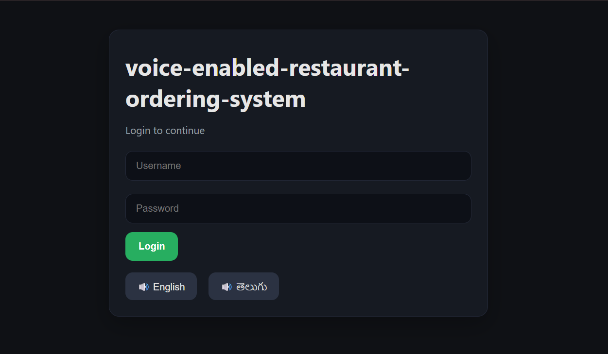
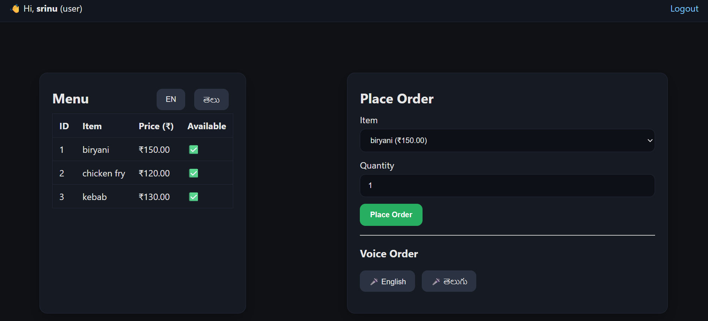
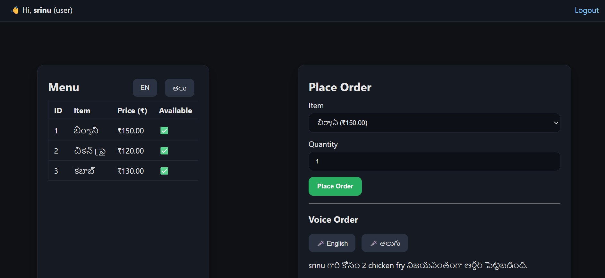
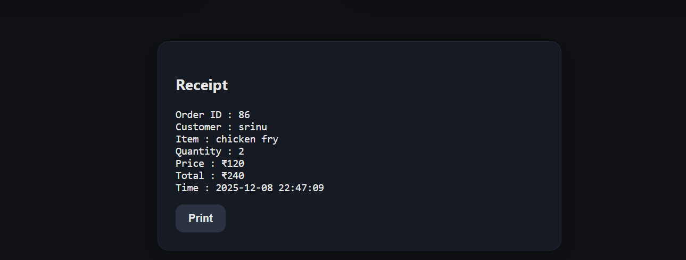
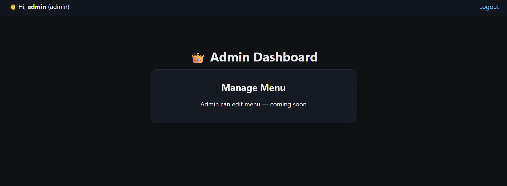

# Voice-Enabled Restaurant Ordering System

A simple Flask-based web application that allows users to order food using
normal button clicks or voice commands (English & Telugu). It also gives spoken
feedback using text-to-speech.


# Features
- Voice-based food ordering
- Text-based ordering using UI
- Login System (User + Admin)
- Basic Admin Dashboard for menu view
- Food receipt with print option
- Multilingual support (English / Telugu)

## Project Folder Structure

```text
Voice-Enabled-Restaurant-Ordering-System/
├── app.py                 # Flask backend
├── requirements.txt       # Dependencies
├── README.md              # Project documentation
├── .gitignore             # Ignore venv, cache, etc.
├── static/
│   ├── css/
│   │   └── style.css
│   └── js/
│       └── main.js
├── templates/
│   ├── index.html
│   └── dashboard.html
└── screenshots/
    ├── login.png
    ├── menu.png
    ├── voice-order.png
    ├── receipt.png
    └── dashboard.png


# Tech Stack
- Python (Flask)
- MySQL
- HTML, CSS, JavaScript
- Web Speech API (Voice Recognition)
- gTTS (Text-to-Speech)


# How to Run the Project

```bash
pip install -r requirements.txt
python app.py

# Default Login Credentials

| Role  | Username | Password |
|-------|----------|----------|
| Admin | admin    | admin123 |
| User  | srinu    | 1234     |

English Commands

| Command              | Example Aliases                      | Result          |
| -------------------- | ------------------------------------ | --------------- |
| “Order biryani”      | “Biryani one” / “One biryani please” | 1 biryani order |
| “Order two biryanis” | “Two biryani”                        | 2 biryani       |
| “Chicken fry please” | “One chicken fry”                    | 1 chicken fry   |
| “Add 2 chicken fry”  | “Two chicken fry order”              | 2 chicken fry   |
| “Kebab order”        | “One kebab please”                   | 1 kebab         |
| “Give me 3 kebabs”   | “Three kebab”                        | 3 kebab         |

Telugu Voice Commands

బిర్యానీ ఆర్డర్ చేయండి → Orders 1 Biryani

బిర్యానీ రెండు ఇవ్వండి → Orders 2 Biryani

చికెన్ ఫ్రై ఇవ్వండి → Orders 1 Chicken Fry

చికెన్ ఫ్రై మూడు పెట్టండి → Orders 3 Chicken Fry

కెబాబ్ ఆర్డర్ చేయండి → Orders 1 Kebab

కెబాబ్ రెండు ఇవ్వండి → Orders 2 Kebab


# Screenshots

# Login Page


# Menu


# Voice Order


# Receipt  


# Admin Dashboard

